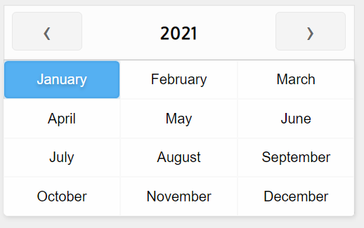

# vue-month-picker

[](https://www.npmjs.com/package/vue-month-picker)
[](https://www.npmjs.com/package/vue-month-picker)
[](https://opensource.org/licenses/MIT)

A lightweight, dependency-free month picker component for **Vue 3** with TypeScript support.



---

## Features

- Zero runtime dependencies
- TypeScript-first (`<script setup>` + Composition API)
- Inline picker (`MonthPicker`) and input-driven picker (`MonthPickerInput`)
- Range selection
- `minDate` / `maxDate` constraints
- Configurable `dateFormat` tokens
- Dark theme
- Year-only mode
- Clearable selection
- 45+ built-in languages

---

## Installation

```bash
npm install vue-month-picker
```

```bash
yarn add vue-month-picker
```

---

## Quick start

### Register globally

```ts
import { createApp } from 'vue'
import App from './App.vue'
import VueMonthPicker from 'vue-month-picker'

createApp(App).use(VueMonthPicker).mount('#app')
```

### Register locally

```vue
<script setup lang="ts">
import { MonthPicker, MonthPickerInput } from 'vue-month-picker'
import type { IDateResult } from 'vue-month-picker'

const onDateChange = (date: IDateResult) => {
  console.log(date.month, date.year)
}
</script>

<template>
  <MonthPicker @change="onDateChange" />
</template>
```

---

## Usage examples

### Inline picker

```vue
<script setup lang="ts">
import { ref } from 'vue'
import { MonthPicker } from 'vue-month-picker'
import type { IDateResult } from 'vue-month-picker'

const date = ref<IDateResult | null>(null)
</script>

<template>
  <MonthPicker @change="date = $event" />
  <p v-if="date">{{ date.month }} {{ date.year }}</p>
</template>
```

### Input-driven picker

```vue
<script setup lang="ts">
import { MonthPickerInput } from 'vue-month-picker'
</script>

<template>
  <MonthPickerInput
    :no-default="true"
    date-format="%n %Y"
    placeholder="Select a month"
  />
</template>
```

### Pre-filled input with a reactive default

```vue
<script setup lang="ts">
import { ref } from 'vue'
import { MonthPickerInput } from 'vue-month-picker'

const month = ref(new Date().getMonth() + 1)
const year = ref(new Date().getFullYear())
</script>

<template>
  <MonthPickerInput
    :input-pre-filled="true"
    :default-month="month"
    :default-year="year"
    date-format="%n, %Y"
  />
</template>
```

### With min/max date constraints

```vue
<template>
  <MonthPicker
    :min-date="new Date(2024, 0, 1)"
    :max-date="new Date(2024, 11, 31)"
    :default-year="2024"
    :default-month="6"
    @change="onDateChange"
  />
</template>
```

### Range selection

```vue
<template>
  <MonthPicker
    :range="true"
    :no-default="true"
    @change="onRangeChange"
  />
</template>
```

### Dark theme

```vue
<template>
  <MonthPicker variant="dark" />
</template>
```

---

## API

> `MonthPicker` and `MonthPickerInput` share the same props and events.

### Props

| Prop               | Type              | Default    | Description |
| ------------------ | ----------------- | ---------- | ----------- |
| `lang`             | `String`          | `"en"`     | Language code for month names. See [supported languages](#languages). |
| `months`           | `String[]`        | —          | Override month names with a custom 12-element array. |
| `default-month`    | `Number`          | —          | Initially selected month (1–12). Omit or use `no-default` to start unselected. |
| `default-year`     | `Number`          | current    | Initially displayed year. |
| `no-default`       | `Boolean`         | `false`    | Start with no month selected. |
| `show-year`        | `Boolean`         | `true`     | Show the year header with navigation arrows. |
| `editable-year`    | `Boolean`         | `false`    | Render the year as a text input instead of a label. |
| `clearable`        | `Boolean`         | `false`    | Allow clicking the selected month again to deselect it. |
| `variant`          | `String`          | `"default"`| Color theme — `"default"` or `"dark"`. |
| `year-only`        | `Boolean`         | `false`    | Hide months and act as a pure year picker. |
| `min-date`         | `Date`            | `null`     | Months before this date are disabled. |
| `max-date`         | `Date`            | `null`     | Months after this date are disabled. |
| `range`            | `Boolean`         | `false`    | Enable two-click range selection. |
| `default-month-range` | `[Number, Number]` | `null` | Default range as `[fromIndex, toIndex]` (0-based). |
| `date-format`      | `String`          | `"%n, %Y"` | Format string for the `MonthPickerInput` display value. See [tokens](#date-format-tokens). |
| `input-pre-filled` | `Boolean`         | `false`    | _(MonthPickerInput only)_ Pre-fill the input on mount using `default-month` and `default-year`. |
| `placeholder`      | `String`          | `null`     | _(MonthPickerInput only)_ Input placeholder text. |
| `highlight-exact-date` | `Boolean`    | `false`    | Only highlight the selected cell when both month and year match. |

### date-format tokens

| Token | Output                   | Example |
| ----- | ------------------------ | ------- |
| `%n`  | Full month name          | `January` |
| `%m`  | Zero-padded month number | `01` |
| `%M`  | Unpadded month number    | `1` |
| `%Y`  | 4-digit year             | `2024` |
| `%y`  | 2-digit year             | `24` |

```
"%n, %Y"  →  January, 2024
"%m/%Y"   →  01/2024
"%M/%y"   →  1/24
"%n %y"   →  January 24
```

### Events

| Event          | Payload        | Description |
| -------------- | -------------- | ----------- |
| `@change`      | `IDateResult`  | Fires whenever the selected value changes, including on mount when a default is set. |
| `@input`       | `IDateResult`  | Fires only on explicit user interaction. Prefer this over `@change` for form bindings. |
| `@change-year` | `Number`       | Fires when the user navigates to a different year. |
| `@clear`       | —              | Fires when the user clears the selection (requires `clearable`). |

### IDateResult

```ts
interface IDateResult {
  from: Date          // first day of the selected month
  to: Date            // last day of the selected month
  month: string       // full month name in the selected language
  monthIndex: number  // 1-based month number
  year: number

  // Range mode only
  rangeFrom?: number       // 0-based start index
  rangeTo?: number         // 0-based end index
  rangeFromMonth?: string  // month name at range start
  rangeToMonth?: string    // month name at range end
}
```

---

## Languages

45+ locales are built in. Pass the ISO code to the `lang` prop:

| Code | Language   | Code | Language    | Code | Language   |
| ---- | ---------- | ---- | ----------- | ---- | ---------- |
| `af` | Afrikaans  | `it` | Italian     | `ru` | Russian    |
| `ar` | Arabic     | `ja` | Japanese    | `sk` | Slovak     |
| `bg` | Bulgarian  | `km` | Khmer       | `sl` | Slovenian  |
| `cs` | Czech      | `ko` | Korean      | `so` | Somali     |
| `da` | Danish     | `ku` | Kurdish     | `sq` | Albanian   |
| `de` | German     | `lt` | Lithuanian  | `sr` | Serbian    |
| `el` | Greek      | `lv` | Latvian     | `sv` | Swedish    |
| `en` | English    | `ms` | Malay       | `th` | Thai       |
| `es` | Spanish    | `ne` | Nepali      | `tr` | Turkish    |
| `et` | Estonian   | `nl` | Dutch       | `uk` | Ukrainian  |
| `fi` | Finnish    | `no` | Norwegian   | `ur` | Urdu       |
| `fr` | French     | `pa` | Punjabi     | `vi` | Vietnamese |
| `he` | Hebrew     | `pl` | Polish      | `yi` | Yiddish    |
| `hi` | Hindi      | `pt` | Portuguese  | `zh` | Chinese    |
| `hr` | Croatian   | `is` | Icelandic   | `zu` | Zulu       |
| `hu` | Hungarian  | `id` | Indonesian  |      |            |

**Language missing?** Open a PR adding a row to `src/languages.ts`, or pass a custom `months` array:

```vue
<MonthPicker :months="['Jan', 'Feb', 'Mar', 'Apr', 'May', 'Jun', 'Jul', 'Aug', 'Sep', 'Oct', 'Nov', 'Dec']" />
```

---

## Development

```bash
# Install dependencies
npm install

# Start dev server (App.vue playground)
npm run dev

# Type-check + build library
npm run build

# Run tests
npm test

# Watch mode
npm run test:watch
```

---

## Contributing

1. Fork the repo
2. Create a feature branch: `git checkout -b my-feature`
3. Commit your changes: `git commit -m 'Add my feature'`
4. Push: `git push origin my-feature`
5. Open a pull request

---

## License

[MIT](https://opensource.org/licenses/MIT)
